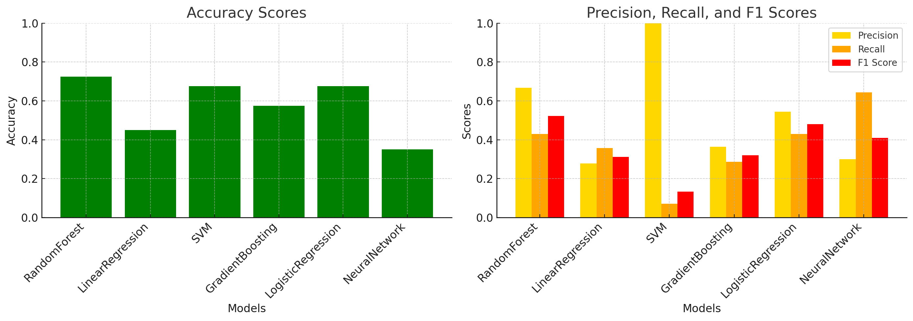
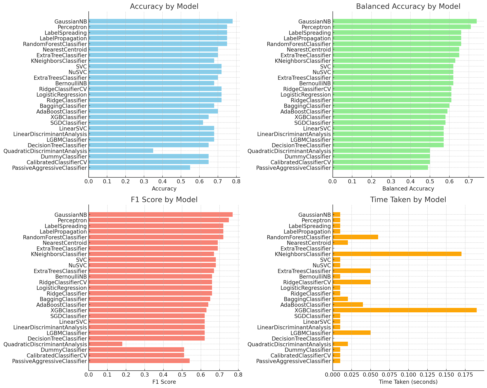

# Fecal Contamination in Agricultural Water

💧This project is dedicated to investigating the impact of various geospatial and meteorological factors on fecal contamination of watersheds.

📖 This dataset is sourced from the publication "**Green, H., Wilder, M., Wiedmann, M., Weller, D.L. Integrative survey of 68 non-overlapping upstate New York watersheds reveals stream features associated with aquatic fecal contamination. Front. Microbiol. 12 (2021). https://doi.org/10.3389/fmicb.2021.684533**". 
Please cite this paper when using this dataset.

# Sample Analysis

## Overview
We utilize a multidisciplinary approach to understand how different factors contribute to water quality. The project looks into:

Presence and Density: Identifying if certain factors are present upstream and calculating their density per 10 km².
Proximity: Determining the flow path distance to the nearest feature of each type.
Water Quality Indicators: Examining parameters like E. coli concentrations, microbial source tracking markers, conductivity, dissolved oxygen, and more.

This repository contains a Python script designed to perform predictions using various machine learning models based on user-specified target labels and algorithms. The script supports several regression models and can handle both numerical and categorical data through preprocessing steps like imputation and one-hot encoding.

## Features

- **Data Preprocessing**: Automatic handling of numerical and categorical data including missing value imputation and one-hot encoding.
- **Dynamic Model Selection**: Users can select from multiple regression models to apply on their specified target label.
- **Command Line Interface**: The script is executable from the command line, allowing users to specify the target label and choice of algorithm dynamically.
- **Binary and Continuous Predictions**: Supports both continuous and binary predictions depending on the chosen target label.

## Installation

### Dependencies
Before you run this script, make sure you have the following installed:
- Python 3.6 or higher
- Pandas
- NumPy
- Scikit-Learn
- Imbalanced-Learn
- seaborn

You can install the necessary libraries using pip:
```bash
pip install pandas numpy scikit-learn imbalanced-learn matplotlib seaborn
```
To get started with this project, follow these steps:

1. Clone the repository:

```bash
git clone https://github.com/FoodDatasets/Predicting-fecal-contamination-in-agricultural-water.git
cd Predicting-fecal-contamination-in-agricultural-water
```
## Supported Algorithms
-  RandomForest: Random Forest Regression
-  LinearRegression: Linear Regression
-  SVM: Support Vector Machines for regression
-  GradientBoosting: Gradient Boosting Regressor

## Machine Learning Model Execution Guide

This script allows users to select different machine learning algorithms via command line parameters to train models and evaluate them on a specified dataset.
### Required Arguments

- `--file_path` (required): The path to your CSV file.
- `--target_label` (required): The target label for the prediction model. Choose from the available target labels in the dataset.
- `--algorithm` (required): The algorithm to use. Options include `RandomForest`, `LinearRegression`, `SVM`, `GradientBoosting`.
### Available target labels:
- `combined_label` This label combine the following labels together: HF183_pa, Rum2Bac_pa, and GFD_pa, if one of them is Positive,the label is Positive


### Optional Arguments
##### GBM (Gradient Boosting Machine) and RandomForest Specific Arguments
- `--n_estimators`: The number of trees in the forest (default: 100). Applicable for `RandomForest` and `GradientBoosting`.
  

- `--max_depth`: The maximum depth of the tree (default: None). Applicable for `RandomForest` and `GradientBoosting`.
##### SVM (Support Vector Machine) Specific Arguments
- `--C`: The regularization parameter (default: 1.0). Applicable for the `SVM` algorithm.

- `--kernel`: The kernel type to be used in the algorithm (default: 'rbf'). Applicable for the `SVM` algorithm. Options include linear, poly, rbf, sigmoid, precomputed.
``` bash
python script.py --file_path path/to/mstdata.csv --target_label combined_label --algorithm GradientBoosting 

```


### Usage Example
``` bash
python ML_runner.py --file_path path/to/mstdata.csv --target_label combined_label --algorithm RandomForest --n_estimators 200


```
## Example output of four algorithms



### Performance Table

| Algorithm             | Accuracy | Precision | Recall | F1 Score |
|-----------------------|----------|-----------|--------|----------|
| **RandomForest**      | 0.725    | 0.667     | 0.429  | 0.522    |
| **LinearRegression**  | 0.450    | 0.278     | 0.357  | 0.312    |
| **SVM**               | 0.675    | 1.000     | 0.071  | 0.133    |
| **GradientBoosting**  | 0.575    | 0.364     | 0.286  | 0.320    |
| **Logistic Regression** | 0.675    | 0.545     | 0.429  | 0.480    |
| **Neural Network**      | 0.350    | 0.300     | 0.643  | 0.409    |


# LazyPredict Method

## Dependencies

- Python 3.7+
- pandas
- scikit-learn
- LazyPredict
- imbalanced-learn (optional, for handling class imbalance)

Install the required packages

```bash
pip install pandas scikit-learn lazypredict imbalanced-learn
```

## Usage
Run the script with the datset file, file path and target column

``` bash
python ML_TEST.py --file_path /path/to/mstdata.csv --target_label combined_label --algorithm LazyClassifier
```
### Command-line Arguments
- `--file_path`: Path to the CSV file containing the dataset (required).
- `--target_label`
- `--algorithm`
Available target labels: `combined_label`

## Example Output 
### combined_label



| Model                          | Accuracy | Balanced Accuracy | ROC AUC | F1 Score | Time Taken |
|--------------------------------|----------|-------------------|---------|----------|------------|
| GaussianNB                     | 0.78     | 0.74              | 0.74    | 0.77     | 0.01       |
| Perceptron                     | 0.75     | 0.71              | 0.71    | 0.75     | 0.01       |
| LabelSpreading                 | 0.75     | 0.66              | 0.66    | 0.72     | 0.01       |
| LabelPropagation               | 0.75     | 0.66              | 0.66    | 0.72     | 0.01       |
| RandomForestClassifier         | 0.75     | 0.66              | 0.66    | 0.72     | 0.06       |
| NearestCentroid                | 0.70     | 0.65              | 0.65    | 0.69     | 0.02       |
| ExtraTreeClassifier            | 0.70     | 0.65              | 0.65    | 0.69     | 0.00       |
| KNeighborsClassifier           | 0.68     | 0.63              | 0.63    | 0.67     | 0.17       |
| SVC                            | 0.72     | 0.62              | 0.62    | 0.68     | 0.01       |
| NuSVC                          | 0.72     | 0.62              | 0.62    | 0.68     | 0.01       |
| ExtraTreesClassifier           | 0.70     | 0.62              | 0.62    | 0.67     | 0.05       |
| BernoulliNB                    | 0.68     | 0.62              | 0.62    | 0.66     | 0.01       |
| RidgeClassifierCV              | 0.72     | 0.61              | 0.61    | 0.66     | 0.05       |
| LogisticRegression             | 0.72     | 0.61              | 0.61    | 0.66     | 0.01       |
| RidgeClassifier                | 0.72     | 0.61              | 0.61    | 0.66     | 0.01       |
| BaggingClassifier              | 0.68     | 0.60              | 0.60    | 0.65     | 0.02       |
| AdaBoostClassifier             | 0.70     | 0.59              | 0.59    | 0.64     | 0.04       |
| XGBClassifier                  | 0.65     | 0.58              | 0.58    | 0.63     | 0.19       |
| SGDClassifier                  | 0.62     | 0.58              | 0.58    | 0.62     | 0.01       |
| LinearSVC                      | 0.68     | 0.57              | 0.57    | 0.62     | 0.01       |
| LinearDiscriminantAnalysis     | 0.68     | 0.57              | 0.57    | 0.62     | 0.01       |
| LGBMClassifier                 | 0.68     | 0.57              | 0.57    | 0.62     | 0.05       |
| DecisionTreeClassifier         | 0.65     | 0.57              | 0.57    | 0.62     | 0.00       |
| QuadraticDiscriminantAnalysis  | 0.35     | 0.50              | 0.50    | 0.18     | 0.02       |
| DummyClassifier                | 0.65     | 0.50              | 0.50    | 0.51     | 0.01       |
| CalibratedClassifierCV         | 0.65     | 0.50              | 0.50    | 0.51     | 0.01       |
| PassiveAggressiveClassifier    | 0.55     | 0.49              | 0.49    | 0.54     | 0.01       |


