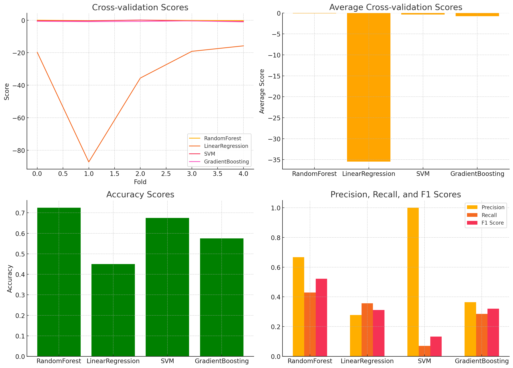
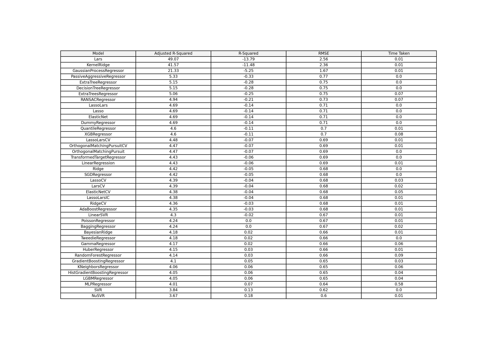
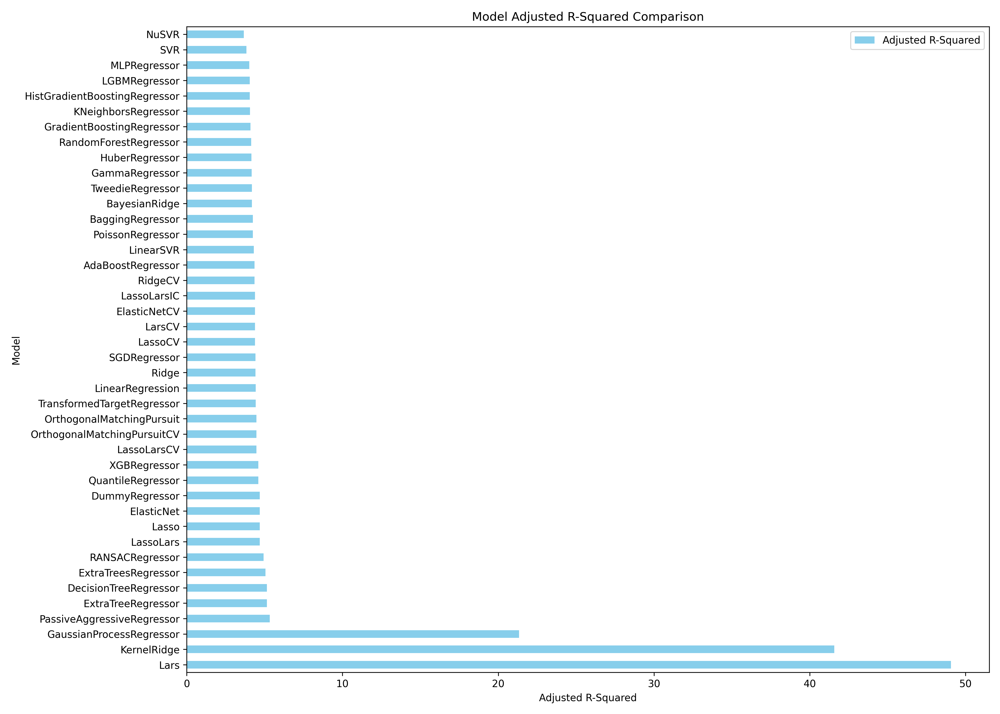
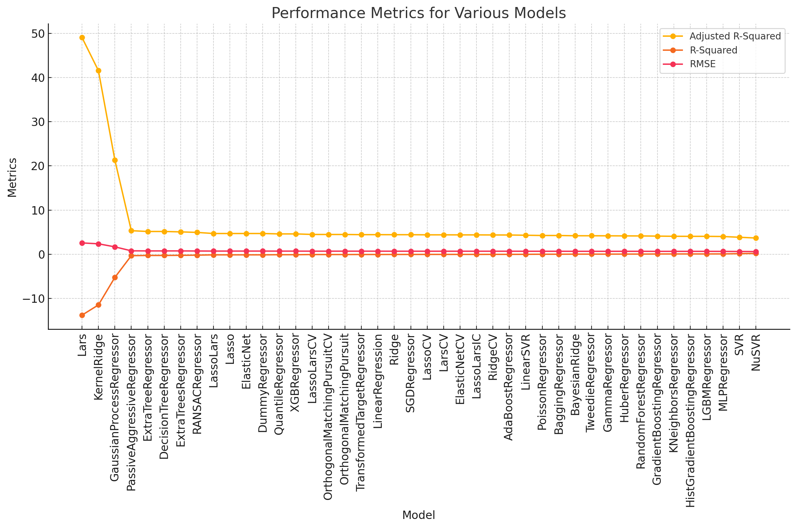

# Fecal contamination in agricultural water

💧This project is dedicated to investigating the impact of various geospatial and meteorological factors on fecal contamination of watersheds.

📖 This dataset is sourced from the publication "**Green, H., Wilder, M., Wiedmann, M., Weller, D.L. Integrative survey of 68 non-overlapping upstate New York watersheds reveals stream features associated with aquatic fecal contamination. Front. Microbiol. 12 (2021). https://doi.org/10.3389/fmicb.2021.684533**". 
Please cite this paper when using this dataset.

# Sample analysis

## Analysis Focus
We utilize a multidisciplinary approach to understand how different factors contribute to water quality. The project looks into:

Presence and Density: Identifying if certain factors are present upstream and calculating their density per 10 km².
Proximity: Determining the flow path distance to the nearest feature of each type.
Water Quality Indicators: Examining parameters like E. coli concentrations, microbial source tracking markers, conductivity, dissolved oxygen, and more.

# Machine Learning Model Predictor

This repository contains a Python script designed to perform predictions using various machine learning models based on user-specified target labels and algorithms. The script supports several regression models and can handle both numerical and categorical data through preprocessing steps like imputation and one-hot encoding.

## Features

- **Data Preprocessing**: Automatic handling of numerical and categorical data including missing value imputation and one-hot encoding.
- **Dynamic Model Selection**: Users can select from multiple regression models to apply on their specified target label.
- **Command Line Interface**: The script is executable from the command line, allowing users to specify the target label and choice of algorithm dynamically.
- **Binary and Continuous Predictions**: Supports both continuous and binary predictions depending on the chosen target label.

## Prerequisites

Before you run this script, make sure you have the following installed:
- Python 3.6 or higher
- Pandas
- NumPy
- Scikit-Learn
- Imbalanced-Learn
- seaborn

You can install the necessary libraries using pip:
```bash
pip install pandas numpy scikit-learn imbalanced-learn matplotlib seaborn
```

## Usage 
- ** Command Line Execution: Run the script from the command line by specifying the target label and the algorithm you want to use.
## Required Arguments

- `--file_path` (required): The path to your CSV file.
- `--target_label` (required): The target label for the prediction model. Choose from the available target labels in the dataset.
- `--algorithm` (required): The algorithm to use. Options include `RandomForest`, `LinearRegression`, `SVM`, `GradientBoosting`.
### Available target labels:
- `combined_label` This label combine the following labels together: HF183_pa, Rum2Bac_pa, and GFD_pa, if one of them is Positive,the label is Positive


## Optional Arguments

- `--n_estimators`: The number of trees in the forest (default: 100). Applicable for `RandomForest` and `GradientBoosting`.
  

- `--max_depth`: The maximum depth of the tree (default: None). Applicable for RandomForest and GradientBoosting.

- `--C`: The regularization parameter (default: 1.0). Applicable for the SVM algorithm.

- `--kernel`: The kernel type to be used in the algorithm (default: 'rbf'). Applicable for the SVM algorithm. Options include linear, poly, rbf, sigmoid, precomputed.

``` bash
python script.py --file_path path/to/mstdata.csv --target_label combined_label --algorithm GradientBoosting 

```

## Supported Algorithms
-  RandomForest: Random Forest Regression
-  LinearRegression: Linear Regression
-  SVM: Support Vector Machines for regression
-  GradientBoosting: Gradient Boosting Regressor

## Example
``` bash
python ML_runner.py --file_path path/to/mstdata.csv --target_label combined_label --algorithm RandomForest --n_estimators 200


```
## Output



# LazyPredict Method

## Dependencies

- Python 3.7+
- pandas
- scikit-learn
- LazyPredict
- imbalanced-learn (optional, for handling class imbalance)

Install the required packages

```bash
pip install pandas scikit-learn lazypredict imbalanced-learn
```

## Usage
Run the script with the datset file, file path and target column

``` bash
python ML_TEST.py --file_path /path/to/mstdata.csv --target_label remainder__ecoli
```
Available target labels:
- remainder__HF183_pa
- remainder__Rum2Bac_pa
- remainder__DG3_pa
- remainder__GFD_pa

## Example Output: remainder__ecoli
### Model Performance

The results of the model evaluations, including adjusted R-Squared, R-Squared, RMSE, and time taken for each model, are summarized in a table and visualized in a bar chart.

#### Model Performance Table



#### Model Adjusted R-Squared Comparison



These visualizations provide a clear overview of how different models perform on the dataset.

#### Model Comparison



